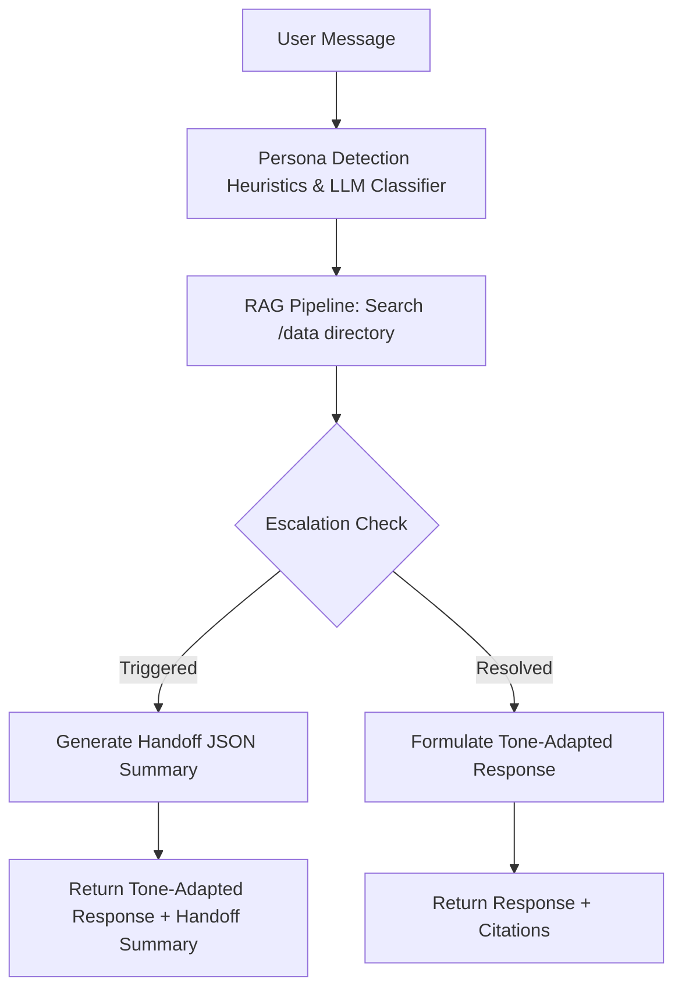

# Persona-Adaptive Customer Support Agent (OmniSupport)

OmniSupport is a production-grade, persona-aware customer support platform built for the Adsparkx AI Engineer Intern assignment. It identifies the customer's communication persona (Technical Expert, Frustrated User, or Business Executive), retrieves relevant support documents from a document-based knowledge base (RAG pipeline), adapts its response tone to match the customer's mindset, and automatically escalates to human agents with a structured handoff summary when needed.

---

## 🏗️ Architecture & Workflow

The following diagram illustrates how user queries traverse the system:



---

## 🛠️ Tech Stack & Versions

- **Backend core**: Python 3.11+ / FastAPI v0.109+ / Uvicorn v0.27+
- **RAG & Vector Database**:
  - `pypdf` (PDF extraction)
  - `reportlab` (PDF generation)
  - `faiss-cpu` (Vector index)
  - `sentence-transformers` (all-MiniLM-L6-v2 embeddings)
  - Heuristic keyword ranking matching (fallback)
- **Workflow & LLM**:
  - `langchain` / `langchain-core` / `google-generativeai` (Gemini API)
- **User Interfaces**:
  - **Streamlit** (interactive web UI chatbot)
  - **CLI Shell** (interactive terminal chatbot)
  - **React Dashboard Console** (full agent ticketing panel with WebSockets)

---

## 🎭 Persona Detection Strategy

The agent dynamically segments customers into three personas:
1. **Technical Expert**: Uses developer terminology (e.g., *API, credentials, auth, logs, database timeout*).
   - *Prompt / Rule*: Delivers deep root-cause analysis, system configurations, and step-by-step technical procedures.
2. **Frustrated User**: Employs emotionally charged words (e.g., *broken, nothing works, terrible, immediately, angry*).
   - *Prompt / Rule*: Emphasizes extreme empathy, reassures the user, avoids dense technical jargon, and provides clear, action-oriented instructions.
3. **Business Executive**: Focuses on commercial outcomes (e.g., *impact, operations, cost, timeline, ROI*).
   - *Prompt / Rule*: Delivers high-level summaries focusing on operational impact, resolution timelines, and operational risk mitigation.

*Implementation Note*: The system uses a dual-engine classifier. If `GEMINI_API_KEY` is present, it uses an LLM structured JSON classifier. If offline or in mock mode, it uses a regex-keyword scanner and sentiment heuristic to classify the persona cleanly without calling external APIs.

---

## 📚 RAG Pipeline Design

### 1. Document Loading & Chunking
- Documents are committed under the `/data` directory in the project root.
- **Markdown / TXT Chunker**: Split based on markdown section headers (`#`, `##`, `###`) to keep sections contextually coherent.
- **PDF Chunker (pypdf)**: Extracts text page-by-page. For multi-paragraph pages, it chunks text into blocks of ~600 characters to preserve context and assigns the exact page numbers as metadata.

### 2. Embeddings & Retrieval
- **Vector Search (Default)**: Generates 384-dimensional embeddings using `SentenceTransformer("all-MiniLM-L6-v2")` and stores them in a local flat L2 FAISS index.
- **Keyword Fallback**: If running in offline test suites (where downloading weights is bypassed), it utilizes a TF-IDF matching engine scoring titles (weight 15) and content occurrences (weight 2).
- **Citations**: Chunks return metadata consisting of the `Source Document` and `Location` (e.g., *Page 2* or *Section: Technical Support*).

---

## 🚨 Escalation Logic & Human Handoff

The agent checks for escalation immediately after retrieval:
1. **Sensitive Topics**: Keywords relating to `billing, refunds, invoices, stripe, account locks, GDPR, legal compliance` trigger automatic human routing.
2. **Low Confidence**: If no matching documentation is found in the knowledge base (confidence < 0.30).
3. **Customer Frustration / Multi-turn Dissatisfaction**: Triggers human handoff if the history shows repeated complaints.

When an escalation occurs, it outputs the following structured handoff JSON:
```json
{
  "persona": "Frustrated User",
  "issue": "I need a refund for my subscription invoice...",
  "documents_used": ["billing_and_invoicing_policy.pdf"],
  "attempted_steps": ["Search Knowledge Base"],
  "recommendation": "Review stripe billing logs and invoice transactions."
}
```

---

## 🚀 Setup & Execution Instructions

### 1. Installation
Clone the repository and install the dependencies:
```bash
# Create and activate virtual environment in backend
cd backend
python -m venv venv
.\venv\Scripts\activate

# Install dependencies
pip install -r requirements.txt
```

### 2. Generate Support Documents (Knowledge Base)
To populate the `/data` directory with 11 Markdown guides and 1 PDF policy:
```bash
python generate_docs.py
```

### 3. Run the Automated Tests (5 Query Scenarios)
Verify the RAG pipeline, persona classification, tone adaptation, and escalation/handoff logic immediately:
```bash
# Skips ML downloading for instant execution
$env:FORCE_KEYWORD_SEARCH="true"
python run_examples.py
```

### 4. Run the Streamlit Interface (Bonus UI)
Launch the interactive web chatbot showing persona badges, citations, and handoff blocks:
```bash
# Run the Streamlit app
$env:FORCE_KEYWORD_SEARCH="true"   # Omit this to download semantic models
streamlit run streamlit_app.py
```

### 5. Run the Interactive CLI Chatbot
Interact with the chatbot in the terminal:
```bash
$env:FORCE_KEYWORD_SEARCH="true"
python cli_agent.py
```

### 6. Run the React Console Dashboard
1. **Backend Server**:
   ```bash
   uvicorn app.main:app --reload
   ```
2. **Frontend UI**:
   ```bash
   cd ../frontend
   npm install
   npm run dev
   ```
   Open `http://localhost:5173/` in your browser.

---

## 🔑 Environment Variables

Configure your key in `backend/.env`:
```env
GEMINI_API_KEY=your_google_gemini_api_key
OPENAI_API_KEY=your_openai_api_key
DATABASE_URL=sqlite:///./omnisupport.db
FORCE_KEYWORD_SEARCH=true
```

---

## 🧪 Example Queries (Included in Test Suite)

1. **Technical Expert**: *"Can you explain the API authentication failure and provide error details?"*
2. **Frustrated User**: *"I've tried everything and nothing works! The dashboard statistics are completely spinning and won't load!"*
3. **Business Executive**: *"How does this database connection timeout issue impact operations and when will it be resolved?"*
4. **Billing Escalation**: *"I need a refund for my subscription invoice. I was charged twice in June!"*
5. **Low Confidence Escalation**: *"How do I configure active directory SSO syncing with custom user LDAP attributes in Okta?"*

---

## ⚠️ Known Limitations & Future Scope
- **Offline Classification**: The local heuristic uses regex rules. An upgrade would employ a small local model (e.g. Llama-3-8B via Ollama) to run zero-shot offline classifications.
- **Session Memory**: Currently, history is passed in memory. For production, tickets and handoff states should be stored in Redis/PostgreSQL for persistent session memory.
